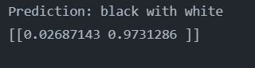

# Object-Detection-Using-Teachable-Machine-Keras-


>This site was built using [Teachable Machine ](https://teachablemachine.withgoogle.com/).
```
In there are two file one is h5 model and second is prediction format
once we done all from Teachable site genrating our own data then we will follow this step in  this manner 


```


## Image white black classified as black with white


## Image white black classified as  white


## OutPut as Array of two value basically in this i have use second image white black combination

